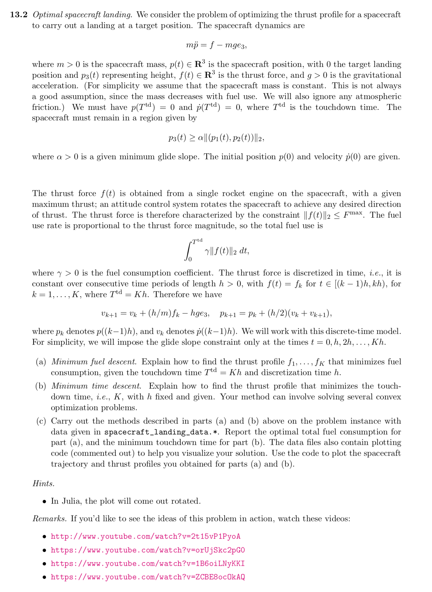
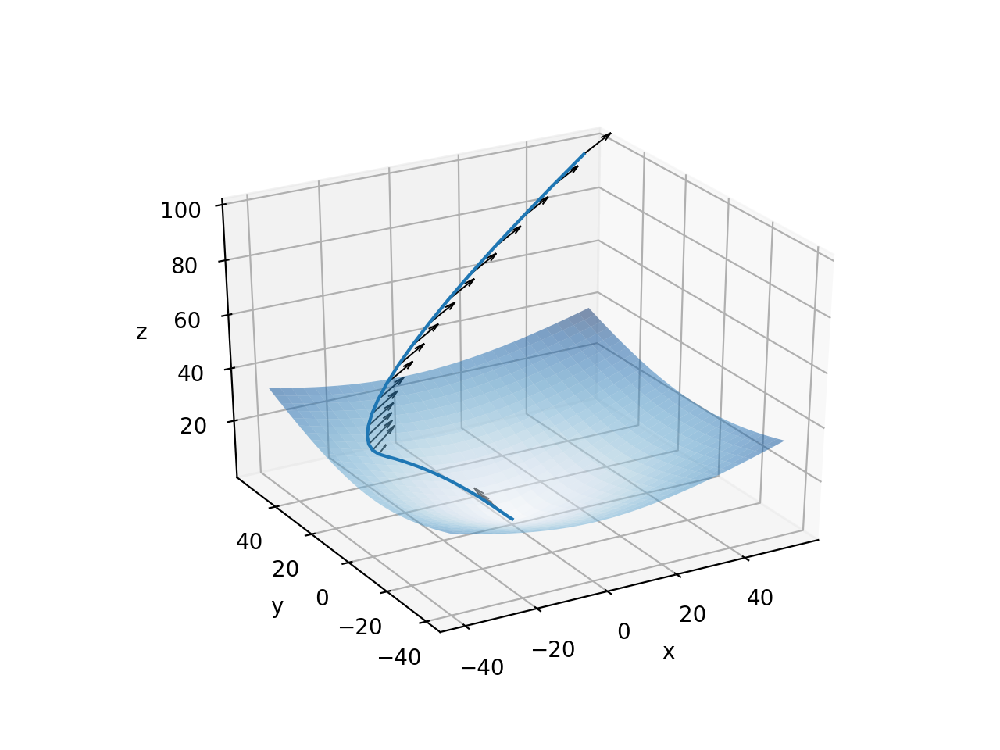

# Optimal Spacecraft Landing

This mini project is based on the 13.2 Optimal spacecraft landing from [Additional Exercises forConvex Optimization](http://web.stanford.edu/~boyd/cvxbook/bv_cvxbook_extra_exercises.pdf).

## Original Exercise



## CVXPY formulation

CVXPY allows to formulate and solve this problem with just a few lines of code.

```python
import cvxpy as cp
import numpy as np

h = 1.
g = 0.1
m = 10.
Fmax = 10.
p0 = np.array([50,50,100])
v0 = np.array([-10,0,-10])
alpha = 0.5
gamma = 1.
e3 = np.array([0,0,1])
K = 35

# CVXPY problem setup
p = cp.Variable((3,K)) # position vectors
v = cp.Variable((3,K)) # velocity vectors
f = cp.Variable((3,K)) # thrust vectors

fuel = 0
for k in range(K):
    fuel = fuel + gamma * h * cp.norm(f[:,k], 2)

objective = cp.Minimize(fuel)
# Initial state
c_init = [
    p[:,0] == p0,
    v[:,0] == v0,
]
# Target
c_end = [
    p[:,-1] == 0,
    v[:,-1] == 0,
]
# Maximal thrust
c_fmax = [cp.norm(f[:,k], 2) <= Fmax  for k in range(K)]
# Glide cone. The spacecraft must remain in this region
c_cone = [p[2,k] >= alpha * cp.norm(p[:2,k], 2) for k in range(K)]
# Spacecraft dynamics constraints
c_vel = [v[:,k+1] == v[:,k] + h/m*f[:,k] - h*g*e3 for k in range(K-1)]
c_pos = [p[:,k+1] == p[:,k] + h/2*(v[:,k] + v[:,k+1]) for k in range(K-1)]

constraints = c_init + c_end + c_fmax + c_cone + c_vel + c_pos
prob = cp.Problem(objective, constraints)
res = prob.solve(verbose=True)
```

CVXPY converts this problem into a Second-Order Cone Program (SOCP) which is then solved by ECOS solver.

The resulting trajectory and thrust vectors can be plotted with matplotlib:


